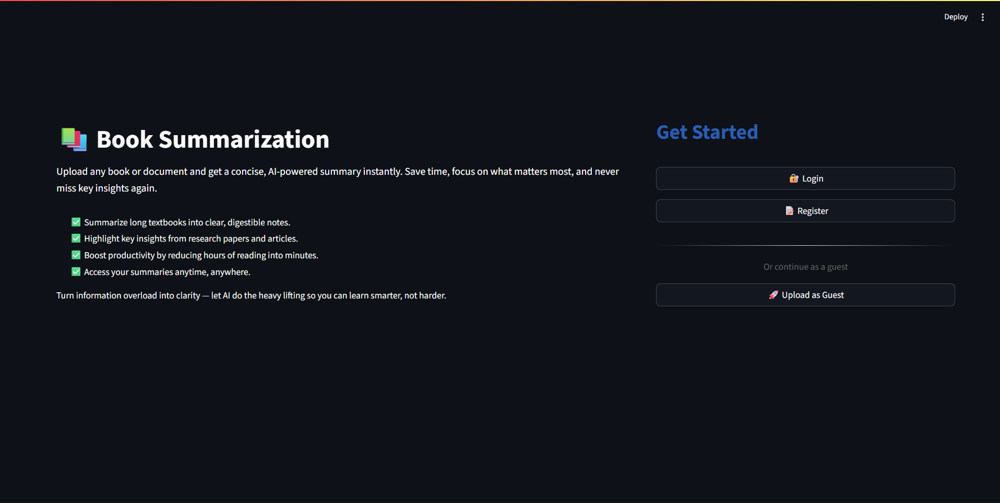
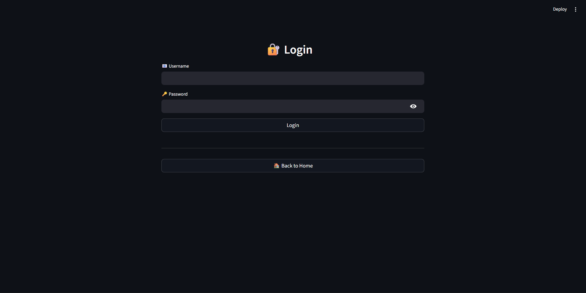
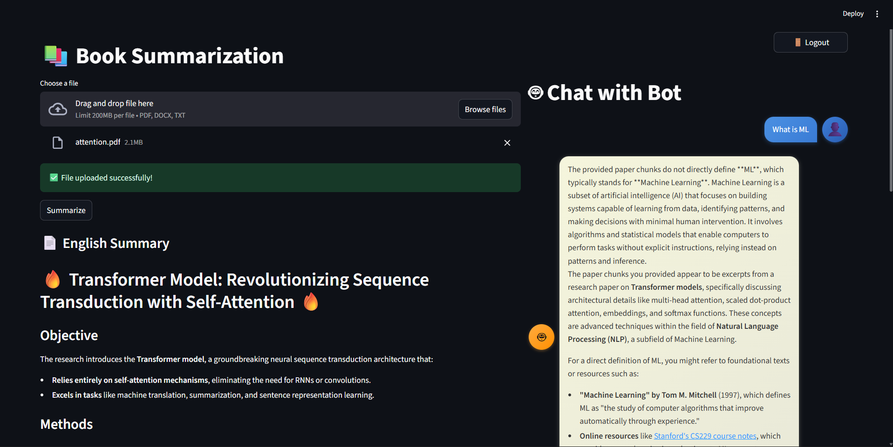
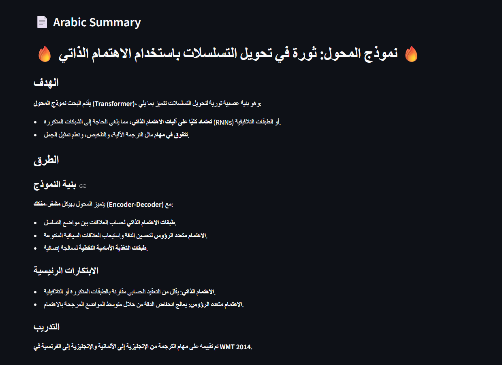

# 📚 Research Assistant with Chat & Translation

This project is an **AI-powered Research Assistant** that helps you:
- 📑 Upload research papers or books (`.pdf`)
- 📝 Generate summaries
- 🌍 Translate documents
- 💬 Chat with the uploaded content (ask questions, extract insights)
- 🔍 Search through research using embeddings

Built with **FastAPI** (backend), **Streamlit** (frontend), **Cohere & Hugging Face embeddings**, and **ChromaDB** (vector database).

---

## ⚡ Features
- Upload PDFs or research papers
- Generate and re-download summaries
- Translate and download translated documents
- Conversational interface to ask questions about uploaded content
- Support for both **Cohere** and **Hugging Face** models for embeddings
- Secure authentication (login/register)

---

## 🛠️ Tech Stack
- **Backend:** FastAPI, Uvicorn  
- **Frontend:** Streamlit  
- **Vector DB:** ChromaDB  
- **Embeddings:** Cohere, Hugging Face (sentence-transformers, transformers)  
- **Document Parsing:** PyPDF, Unstructured  
- **Auth & Security:** Passlib (bcrypt)  
- **Others:** Torch, LangChain, dotenv, ReportLab, arabic-reshaper, python-bidi  

---

## 📦 Installation

Clone the repo:

```bash
git clone https://github.com/yourusername/research-assistant.git
cd research-assistant
```
Create a virtual environment:
```bash
python -m venv venv
source venv/bin/activate   # Mac/Linux
venv\Scripts\activate      # Windows
```
Install dependencies:
 - pip install -r requirements.txt
or manually
```bash
pip install streamlit fastapi pydantic python-dotenv uvicorn pypdf chromadb \
langchain langchain-community langchain-huggingface langchain-cohere \
sentence-transformers transformers accelerate torch \
passlib passlib[bcrypt] reportlab cohere \
unstructured arabic-reshaper python-bidi
```

# ▶️ Running the App
Start the backend (FastAPI):
```bash
uvicorn backend.main:app --reload
```
Start the frontend (Streamlit):
```bash
streamlit run frontend/app.py
```
# 📂 Project Structure
```bash
.
├── backend/
│   ├── main.py           # FastAPI entrypoint
│   ├── routers/          # API routes
│   ├── db/               # Database connection (SQLite, Chroma)
│   ├── services/         # Logic pipeline for RAPTOR
│   ├── data_models/      # Pydantic models
|   ├── models/           # HF models
│   └── utils/            # Some helper functions
|
├── frontend/
│   └── app.py            # Streamlit UI
|
├── summaries/            # The summary Engish or Arabic
|
├── uploads/              # The files will be uploaded here
|
├── README.md
└── requirements.txt
```
# 🔑 Environment Variables
Create a .env file with your API keys:

COHERE_API_KEY=your_cohere_key

# 🖼️ Screenshots & Demo
## Home Page


## 🔐 Authentication (Login/Register)



## 💬 Chat with the Document


## 🌍 Translation



# 📖 Future Improvements

- Add support for multiple file formats (DOCX, TXT, HTML)
- Enhance UI/UX for mobile users
- Multi-user session storage
- Advanced summarization modes (short, detailed, bullet-point)

